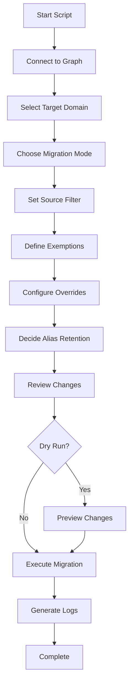

Here's a complete, ready-to-copy Markdown file for your GitHub repository:

---

# UPN/Email Domain Migration Script

[](https://github.com/PowerShell/PowerShell)
[](https://docs.microsoft.com/en-us/graph/overview)
[](LICENSE)

> **A comprehensive PowerShell script for migrating user UPNs and email addresses to a new domain using Microsoft Graph API**

## 📋 Table of Contents

- [Overview](#-overview)
- [Features](#-features)
- [Prerequisites](#-prerequisites)
- [Installation](#-installation)
- [Quick Start](#-quick-start)
- [Usage Guide](#-usage-guide)
- [Interactive Walkthrough](#-interactive-walkthrough)
- [Log Files](#-log-files)
- [Important Notes](#-important-notes)
- [Troubleshooting](#-troubleshooting)
- [Security Best Practices](#-security-best-practices)
- [FAQ](#-faq)
- [License](#-license)

## 🚀 Overview

This PowerShell script provides an interactive, user-friendly interface for migrating users from `.onmicrosoft.com` domains (or any domain) to a target domain using Microsoft Graph API. It's designed to handle complex migration scenarios with features like per-user domain overrides, exemption lists, and alias retention.

**Key Benefits:**
- ✅ No need for Exchange Online modules
- ✅ Modern Graph API authentication
- ✅ Interactive wizard-style interface
- ✅ Comprehensive logging and dry-run support
- ✅ Handles both cloud-only and hybrid environments

## ✨ Features

| Feature | Description |
|---------|-------------|
| **Interactive Wizard** | Step-by-step guidance through the migration process |
| **Multiple Modes** | UPN only, Email only, or Both |
| **Domain Selection** | Choose from verified tenant domains or type manually |
| **Per-User Overrides** | Assign specific domains to individual users |
| **Exemption Lists** | Skip specific users from migration |
| **Alias Retention** | Keep old email addresses as secondary proxies |
| **Smart Filtering** | Target users by domain substring |
| **Dry-Run Mode** | Preview changes before applying |
| **Comprehensive Logging** | CSV logs with detailed status for each user |
| **Hybrid Identity Support** | Automatically skips on-premises synced users |

## 📋 Prerequisites

### System Requirements
- Windows PowerShell 5.1 or later
- PowerShell 7.x (recommended for best performance)
- Administrator access to Microsoft 365 tenant

### Required PowerShell Modules
```powershell
# Install required modules (run once)
Install-Module Microsoft.Graph.Users -Scope CurrentUser -Force
Install-Module Microsoft.Graph.Identity.DirectoryManagement -Scope CurrentUser -Force
```

### Required Graph API Permissions
| Permission | Type | Description |
|------------|------|-------------|
| `User.ReadWrite.All` | Application/Delegated | Read and update user properties |
| `Domain.Read.All` | Application/Delegated | Read domain information |
| `Directory.Read.All` | Application/Delegated | Read directory information |

### Important Requirements
- ⚠️ **Run in a fresh PowerShell session** - Do not connect to Exchange Online first (assembly conflict)
- 🔐 Administrator consent required for Graph API permissions
- 🌐 Target domains must be added and verified in Entra ID (Azure AD)

## 🛠️ Installation

### Method 1: Direct Download
```powershell
# Download the script
Invoke-WebRequest -Uri "https://raw.githubusercontent.com/your-repo/Admin.ps1" -OutFile "Admin.ps1"
```

### Method 2: Manual Copy
1. Create a new file named `Admin.ps1`
2. Copy the script content
3. Save the file in your working directory

### Module Installation (if needed)
```powershell
# Install Microsoft Graph modules
Install-Module Microsoft.Graph.Users -Scope CurrentUser
Install-Module Microsoft.Graph.Identity.DirectoryManagement -Scope CurrentUser

# Verify installation
Get-Module -ListAvailable Microsoft.Graph*
```

## 🚦 Quick Start

```powershell
# Start a fresh PowerShell session
# Navigate to script directory
cd C:\Scripts

# Run the migration script
.\Admin.ps1

# Follow the interactive prompts
```

## 📖 Usage Guide

### Basic Execution Flow



### Migration Modes

| Mode | Updates Performed | Use Case |
|------|------------------|----------|
| **UPN Only** | Changes `UserPrincipalName` | When email routing isn't changing |
| **SMTP Only** | Changes `Mail` attribute | When only email needs to update |
| **BOTH** | Changes both UPN and Mail | Full domain migration (recommended) |

### Interactive Prompts Overview

| Prompt | Description | Example Response |
|--------|-------------|------------------|
| **Target Domain Selection** | Choose from registered domains | `0` or `contoso.com` |
| **Migration Mode** | UPN, SMTP, or BOTH | `3` for BOTH |
| **Source Filter** | Filter users by domain | `onmicrosoft.com` |
| **Exemptions** | Users to skip entirely | `admin@contoso.com, john@contoso.com` |
| **Overrides** | Custom domain per user | `user@domain.com -> fabrikam.com` |
| **Alias Retention** | Keep old address as alias | `Y` or `N` |
| **Dry Run** | Preview changes first | `Y` (recommended) |

## 🎮 Interactive Walkthrough

### Example 1: Standard Migration

```
PowerShell 7.4.1
PS C:\Scripts> .\Admin.ps1

=== Connecting to Microsoft Graph ===
Connected to tenant: 12345678-1234-1234-1234-123456789012

Domains registered on this tenant:
[0] contoso.com  (verified)
[1] contoso.onmicrosoft.com  (verified)
[2] fabrikam.com  (verified)

Select the DEFAULT target domain by index, or 'M' to type one manually: 0

What do you want to update?
[1] UPN only
[2] Primary SMTP (mail) only
[3] Both UPN and mail
Choice: 3

Only process users whose CURRENT UPN/mail contains a specific string?
(e.g. type 'onmicrosoft.com' to only touch cloud-only default accounts)
Filter string: onmicrosoft.com

Enter email/UPN addresses to fully EXEMPT, comma-separated: admin@contoso.onmicrosoft.com

Do any users need a DIFFERENT target domain than the default? (Y/N): N

Keep each user's OLD address as a secondary alias (proxyAddress)? (Y/N): Y

Fetching users...
Found 47 candidate user(s).

Proceed with dry-run preview first? (Y/N): Y

[DRY RUN] John Doe: john.doe@contoso.onmicrosoft.com -> john.doe@contoso.com | john.doe@contoso.onmicrosoft.com -> john.doe@contoso.com
[DRY RUN] Jane Smith: jane.smith@contoso.onmicrosoft.com -> jane.smith@contoso.com | jane.smith@contoso.onmicrosoft.com -> jane.smith@contoso.com
...

Log saved to .\UPN-Migration-Log-20260119-143022.csv

Dry run complete. Run for real now? (Y/N): Y

UPDATED: John Doe -> john.doe@contoso.com
UPDATED: Jane Smith -> jane.smith@contoso.com
...

Final run log saved to .\UPN-Migration-FinalRun-20260119-143045.csv

Done.
```

### Example 2: Advanced Migration with Overrides

```
Do any users need a DIFFERENT target domain than the default? (Y/N): Y

Available domains:
[0] contoso.com
[1] contoso.onmicrosoft.com
[2] fabrikam.com

Enter user's current email/UPN to override (or press Enter to finish): john.doe@contoso.onmicrosoft.com
Which domain should 'john.doe@contoso.onmicrosoft.com' be migrated to? (index or 'M' for manual): 2
Mapped: john.doe@contoso.onmicrosoft.com -> fabrikam.com

Enter user's current email/UPN to override (or press Enter to finish): mary.smith@contoso.onmicrosoft.com
Which domain should 'mary.smith@contoso.onmicrosoft.com' be migrated to? (index or 'M' for manual): 0
Mapped: mary.smith@contoso.onmicrosoft.com -> contoso.com

Enter user's current email/UPN to override (or press Enter to finish): [Press Enter]
```

## 📊 Log Files

### Generated Files

The script creates two CSV log files in the current directory:

```
UPN-Migration-Log-20260119-143022.csv     # Dry run preview
UPN-Migration-FinalRun-20260119-143045.csv # Actual execution
```

### Log Format

| Column | Type | Description |
|--------|------|-------------|
| `DisplayName` | String | User's display name |
| `OldUPN` | String | Current UPN before migration |
| `NewUPN` | String | New UPN after migration |
| `OldMail` | String | Current email address |
| `NewMail` | String | New email address |
| `TargetDomain` | String | Domain applied to this user |
| `OverrideApplied` | Boolean | Whether domain was overridden |
| `AliasKept` | Boolean | Whether old alias was retained |
| `Status` | String | Success/Failure with error message |

### Sample Log Entry

```csv
DisplayName,OldUPN,NewUPN,OldMail,NewMail,TargetDomain,OverrideApplied,AliasKept,Status
John Doe,john.doe@contoso.onmicrosoft.com,john.doe@contoso.com,john.doe@contoso.onmicrosoft.com,john.doe@contoso.com,contoso.com,False,True,Updated
Jane Smith,jane.smith@contoso.onmicrosoft.com,jane.smith@fabrikam.com,jane.smith@contoso.onmicrosoft.com,jane.smith@fabrikam.com,fabrikam.com,True,True,Updated
```

## ⚠️ Important Notes

### Critical Requirements

```yaml
Environment:
  - Session: Fresh PowerShell session (no prior Exchange Online connection)
  - Modules: Microsoft.Graph.Users & Microsoft.Graph.Identity.DirectoryManagement
  - Permissions: User.ReadWrite.All, Domain.Read.All, Directory.Read.All
  
Security:
  - Always run dry-run first
  - Review logs before executing changes
  - Test with small user groups
  - Have a rollback plan
  
Limitations:
  - Hybrid users (on-premises synced) are skipped automatically
  - Must be changed on-premises for hybrid environments
  - Changes may take time to propagate to all systems
  - Unverified domains will likely fail
```

### What Gets Skipped

The script automatically skips:
1. **Hybrid-synced users** (`OnPremisesSyncEnabled = True`) - Must be changed on-premises
2. **Exempted users** - Explicitly defined in the exemption list
3. **Users not matching filter** - If a source filter is applied

## 🔧 Troubleshooting

### Common Issues and Solutions

| Issue | Cause | Solution |
|-------|-------|----------|
| **"No domains found"** | Missing permissions or wrong tenant | Verify `Domain.Read.All` permission and tenant connection |
| **"Failed to update user"** | Target domain not verified | Add and verify domain in Entra ID |
| **Assembly conflict** | Exchange Online module loaded | Start fresh PowerShell session |
| **Module not found** | Graph modules not installed | Install `Microsoft.Graph.Users` and `Identity.DirectoryManagement` |
| **Authentication failed** | Consent missing or expired | Re-authenticate with admin consent |
| **User not found** | Invalid user ID or UPN | Verify user exists and UPN is correct |

### Error Messages and Fixes

#### "Get-MgDomain : Access denied"
```powershell
# Fix: Grant Domain.Read.All permission
Connect-MgGraph -Scopes "User.ReadWrite.All","Domain.Read.All","Directory.Read.All" -Force
```

#### "Update-MgUser : BadRequest"
```
# Causes:
# - Domain not registered or verified
# - Invalid email format
# - Duplicate proxy address
# Fix: Verify domain and email format
```

#### "The module 'Microsoft.Graph.Users' cannot be found"
```powershell
# Fix: Install the module
Install-Module Microsoft.Graph.Users -Scope CurrentUser -Force
```

### Debug Mode

Enable verbose logging for troubleshooting:
```powershell
# Add -Verbose parameter to your function calls
Update-MgUser -UserId $u.Id -BodyParameter $updateParams -Verbose
```

## 🔒 Security Best Practices

### Pre-Migration Checklist

- [ ] **Backup current state** - Export all user attributes before changes
- [ ] **Test in staging** - Use a test tenant or test group first
- [ ] **Dry run review** - Carefully examine the dry-run log
- [ ] **Communication plan** - Notify users of upcoming changes
- [ ] **Rollback strategy** - Have a plan to revert changes if needed
- [ ] **Change approval** - Get necessary approvals before execution

### Security Tips

```yaml
Authentication:
  - Use conditional access policies
  - Implement admin consent workflow
  - Use managed identities when possible
  
Permissions:
  - Grant least-privilege permissions
  - Use specific permission scopes
  - Rotate credentials regularly
  
Script Security:
  - Store scripts in secure locations
  - Use version control with access controls
  - Review script updates before execution
  - Never hardcode credentials in the script
```

## ❓ FAQ

### General Questions

**Q: Does this script work with Exchange Online?**  
A: Yes, it works with Exchange Online via Microsoft Graph. However, run in a fresh session without connecting to Exchange Online first.

**Q: Can I migrate users from one domain to multiple domains?**  
A: Yes! Use the per-user overrides feature to assign different domains to specific users.

**Q: What about shared mailboxes?**  
A: The script operates on user objects only. Shared mailboxes would need to be handled separately.

**Q: Will users be able to login with their new UPN immediately?**  
A: Yes, UPN changes are immediate for cloud-only users. Hybrid users need on-premises changes first.

**Q: How long does the migration take?**  
A: Processing time depends on user count (typically 1-2 seconds per user) plus Graph API latency.

### Technical Questions

**Q: Does this affect Office 365 licenses?**  
A: No, the script doesn't change license assignments.

**Q: Will emails be delivered to the old address?**  
A: If you retain the old address as a proxy (alias), emails to the old address will be delivered.

**Q: Can I run this script unattended?**  
A: The script is interactive by design. For automation, you'll need to modify it to accept parameters.

**Q: What happens if a user has multiple domains in proxy addresses?**  
A: The script only modifies primary SMTP and UPN. Secondary proxies are preserved unless the alias retention feature is used.

**Q: Does it work with bulk user operations?**  
A: Yes, it uses the `-All` parameter to fetch all users and processes them sequentially.

## 🔄 Version History

| Version | Date | Changes |
|---------|------|---------|
| 1.0.0 | 2026-01-19 | Initial release |
| 1.0.1 | 2026-01-20 | Added dry-run support |
| 1.0.2 | 2026-01-21 | Improved error handling |
| 1.0.3 | 2026-01-22 | Added per-user domain overrides |

## 🤝 Contributing

Contributions are welcome! Here's how you can help:

1. **Report issues** - Open an issue with detailed error information
2. **Feature requests** - Suggest improvements or new features
3. **Code contributions** - Submit pull requests with clear descriptions
4. **Documentation** - Improve or expand documentation

### Development Setup
```powershell
# Clone the repository
git clone https://github.com/yourusername/upn-migration-script.git

# Install development dependencies
Install-Module -Name Pester -Force

# Run tests
Invoke-Pester
```

### Code Style Guidelines
- Follow PowerShell best practices
- Include comprehensive comments
- Add parameter validation
- Write unit tests for new features
- Update documentation accordingly

## 📝 License

This project is licensed under the MIT License - see the [LICENSE](LICENSE) file for details.

### Disclaimer
```
THIS SOFTWARE IS PROVIDED "AS IS", WITHOUT WARRANTY OF ANY KIND, EXPRESS OR IMPLIED,
INCLUDING BUT NOT LIMITED TO THE WARRANTIES OF MERCHANTABILITY, FITNESS FOR A PARTICULAR
PURPOSE AND NONINFRINGEMENT. IN NO EVENT SHALL THE AUTHORS OR COPYRIGHT HOLDERS BE LIABLE
FOR ANY CLAIM, DAMAGES OR OTHER LIABILITY, WHETHER IN AN ACTION OF CONTRACT, TORT OR
OTHERWISE, ARISING FROM, OUT OF OR IN CONNECTION WITH THE SOFTWARE OR THE USE OR OTHER
DEALINGS IN THE SOFTWARE.
```
<p align="center">
  <i>🌟 If this script helped you, please give it a star on GitHub!</i>
</p>

<p align="center">
  <sub>Built with ❤️ for the Microsoft 365 community</sub>
</p>

---

**Found a bug or have a suggestion?** Please [open an issue](https://github.com/yourusername/upn-migration-script/issues) and help improve this tool for everyone!
